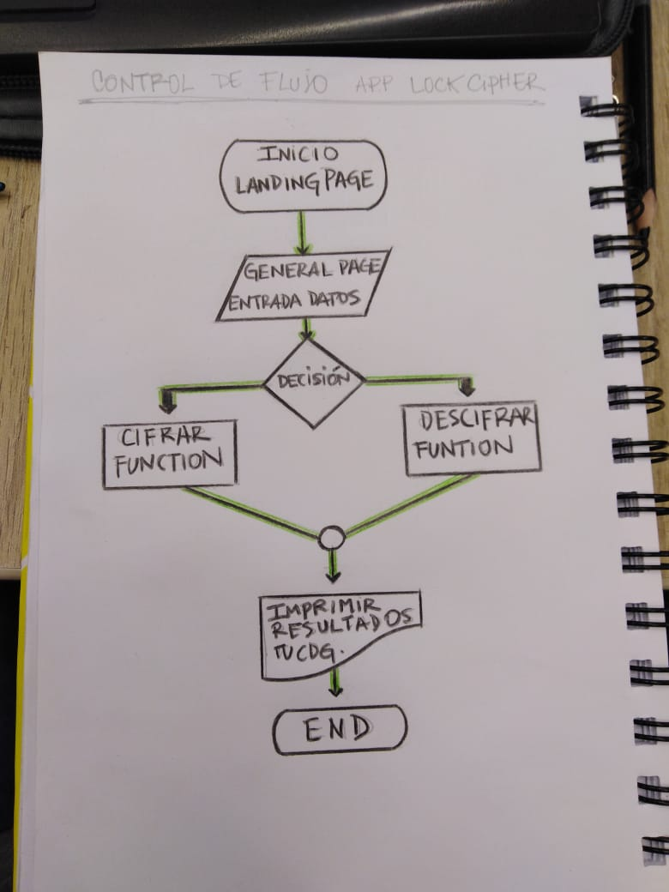
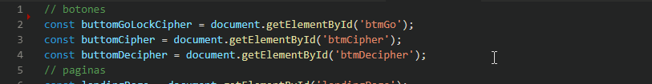
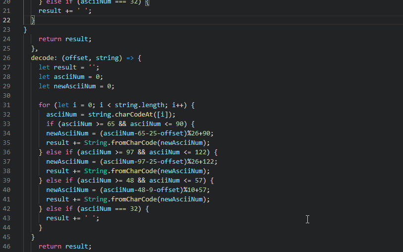

# LockCipher 
### Abre con un codigo

Es una plataforma innovadora  que permite abrir puertas y ventanas del Hotel GeekHigher, donde la tecnologia no es solo una excusa sino que predomina entre los servicios y la vida diaria del lugar. Es
basado en el cifrado de cesar. El **cifrado de cesar** es uno de los primeros métodos de cifrado más conocido para cifrar una mensaje.

Los usuarios que deseen hacer uso de esta modalidad, para abrir puertas y ventanas deberan ingresar su codigo personal. 

Accede a la plataforma haciendo click en el link: GHP

## LockCipher es para...

Todo huesped, aficionado de la tecnologia que desee hacer uso de ella en todo momento. 

## Beneficios de usar LockCipher

+ Solucion al cierre de puertas que prevee seguridad simple y comoda, incluso cuando salen de la habitación por un tiempo corto.

+ Uso fácil y cómodo para entradas y salidas frecuentes.

+ Funcionamiento simple: ingresar código digital generado a raiz del cifrado de su nombre. 

## Una justa solucion 

Confianza y comodidad, reemplaza las llaves. Que tienden a generar peso y estrés en caso de sufrir alguna perdida.

## Construido con 🛠️

VanillaJS

### FlowChart

### Ejemplos de Codigo

## Autorx ✒️

__* Maria Gabriela López__ [LoopMg](https://gist.github.com/loopMg)
